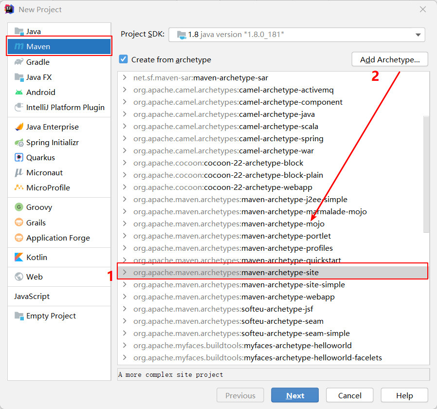
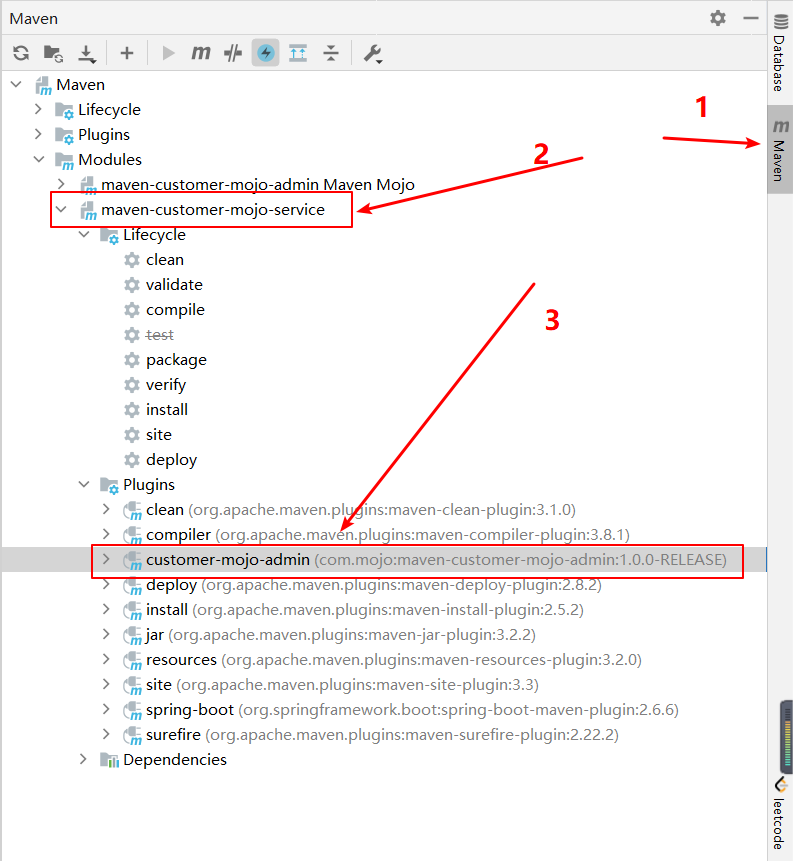

# Quick Started

## 认识Mojo工程
### 概念
Mojo 就是 Maven plain Old Java Object。每一个 Mojo 就是 Maven 中的一个执行目标（executable goal），而插件则是对单个或多个相关的 Mojo 做统一分发。一个 Mojo 包含一个简单的 Java 类。插件中多个类似 Mojo 的通用之处可以使用抽象父类来封装。

### 命名规范
Maven的官方插件命名格式为maven-xxx-plugin。为了避免侵犯官方商标，我们一般将自己开发的插件命名为xxx-maven-plugin。遵守这个规范，可以简化插件的运行命令。

### 创建插件项目
Maven的插件是一个Mojo(Maven plain Old Java Object)工程，每一个Mojo就是Maven中的一个执行目标（executable goal），而插件是对单个或多个相关的Mojo做统一分发。一个Mojo就是一个简单的Java类。

依次点击New -> Project -> Maven，勾选Create from archetype，选择maven-archetype-mojo，填写好相关信息，即可创建一个简单的Mojo工程。

创建好maven-customer-mojo-admin工程之后，项目工程里会默认生成一个MyMojo类，内容如下：
```java
/**
* Goal which touches a timestamp file.
*
* @goal touch
*
* @phase process-sources
*/

public class MyMojo extends AbstractMojo {
    /**
    * Location of the file.
    * @parameter expression="${project.build.directory}"
    * @required
    */
    private File outputDirectory;
    public void execute() throws MojoExecutionException {
        File f = outputDirectory;
        if ( !f.exists() ) {
            f.mkdirs();
        }
        File touch = new File( f, "touch.txt" );
        FileWriter w = null;
        try {
            w = new FileWriter( touch );
            w.write( "touch.txt" );
        } catch ( IOException e ) {
            throw new MojoExecutionException( "Error creating file " + touch, e );
        } finally {
            if ( w != null ) {
                try {
                    w.close();
                } catch ( IOException e ) {
                    // ignore
                }
            }
        }
    }
}
```
Mojo类继承自AbstractMojo，每个Mojo类都有一个execute方法，用来实现插件的逻辑。上面自动生成的代码逻辑很简单，找到项目的输出目录(项目根目录下的target文件夹)，在该目录下创建一个名为touch.txt的文件，文件内容写入"touch.txt"。

### 使用插件
#### mvn Install
在maven-customer-mojo-admin项目中执行maven的install命令,此时插件就像生成JAR一样存在了你的本地Maven仓库中

#### 在项目maven-customer-mojo-service引入自定义插件
新建或打开另一个maven项目(此处使用的是maven-customer-mojo-service项目)，在pom文件的 build -> plugins 中加入如下内容：
```xml
 <build>
    <plugins>
        <plugin>
            <groupId>com.mojo</groupId>
            <artifactId>maven-customer-mojo-admin</artifactId>
            <version>1.0.0-RELEASE</version>
        </plugin>
    </plugins>
</build>
```
在该项目的Maven Projects中可以看到customer-mojo-admin插件。因为插件项目的artifactId为customer-mojo-admin，名称中的maven和plugin会被忽略，所以插件名称就是一个简单的customer-mojo-admin

展开插件可以看到Mojo列表，由于项目里只有一个Mojo，且Mojo上用注释@goal指定了名称为touch，所以这里只能看到一个 customer-mojo-admin:touch。
#### 执行插件
双击hello:touch就会执行这个插件。执行完毕后，可以看到项目根目录的target文件下多了个touch.txt文件。

#### 命令行执行插件
命令格式为mvn groupId:artifactId:version:goal，执行如下命令：

mvn com.mojo:maven-customer-mojo-admin:1.0.0-RELEASE:touch
由于我们的插件命名符合规范，所以上面的命令可以简写为：
mvn customer-mojo-admin:touch

## 自定义Maven插件

### Mojo配置方式
Mojo的配置有两种方式，一种是JavaDoc + Tag，即上面的示例代码所使用的方式。另一种是注解，使用@Mojo, @Parameter等annotation来配置。

**上例中各个Tag的作用：**
* @goal 指定了这个mojo的名称
* @phase 插件生效的生命周期
* @parameter 用于参数，通过expression为参数注入指定的值，比如例子中的${project.build.directory}。project.build.directory是maven内置的属性，代表项目build的根目录。其他内置属性可参考下面。
* @required 代表参数是必须的

### 开发Mojo
#### 添加依赖
```xml
<dependencies>
    <!-- 添加对maven-plugin-api的依赖，这个依赖里面会包含一些 Mojo 的接口与抽象类。 
    https://mvnrepository.com/artifact/org.apache.maven/maven-plugin-api -->
    <dependency>
      <groupId>org.apache.maven</groupId>
      <artifactId>maven-plugin-api</artifactId>
      <version>3.6.3</version>
    </dependency>
    
    <!--怎么让 Maven 知道这是一个 Mojo 而不是一个普通的 Java 类呢？这里，就需要说一下 Mojo 的查找机制了，
    在处理源码的时候，plugin-tools 会把使用了 @Mojo 注解或 Javadoc 里包含 @goal 注释的类来当作一个 Mojo 类。 
    https://mvnrepository.com/artifact/org.apache.maven.plugin-tools/maven-plugin-annotations -->
    <dependency>
      <groupId>org.apache.maven.plugin-tools</groupId>
      <artifactId>maven-plugin-annotations</artifactId>
      <version>3.6.0</version>
      <scope>provided</scope>
    </dependency>
</dependencies>
```
与普通 pom.xml 文件一个重要的不同之处是它的打包方式：
```xml
<packaging>maven-plugin</packaging>
```

#### 编写Maven工程
Mojo 是一个简单的 Java 类，那我们创建第一个 Mojo 类用于打印一行输出。

Mojo类需要继承 AbstractMojo 这个抽象类，并实现了 execute() 方法，该方法就是用来定义这个 Mojo 具体操作内容，我们只需要根据自己的需要来编写自己的实现即可。
* 方式一：@goal
```java
package com.mojo.example;

import org.apache.maven.plugin.AbstractMojo;
import org.apache.maven.plugin.MojoExecutionException;
import org.apache.maven.plugin.MojoFailureException;
import org.apache.maven.plugins.annotations.Mojo;

/**
 * @author：Psyduckzzzz
 * @Date：Created on 2022/4/21 18:28
 * @Description:测试自定义Mojo 方式一：@goal
 * @goal hello
 */
public class HelloMojo extends AbstractMojo {

    public void execute() throws MojoFailureException {
        getLog().info("========= HelloMojo ==========");
    }
}
```

* 方式二：@Mojo
```java
package com.mojo.example;

import org.apache.maven.plugin.AbstractMojo;
import org.apache.maven.plugin.MojoExecutionException;
import org.apache.maven.plugin.MojoFailureException;
import org.apache.maven.plugins.annotations.LifecyclePhase;
import org.apache.maven.plugins.annotations.Mojo;

/**
 * @author：Psyduckzzzz
 * @Date：Created on 2022/4/21 18:28
 * @Description:测试自定义Mojo 方式二：@Mojo
 */
@Mojo(name = "helloWorld")
public class HelloWorldMojo extends AbstractMojo {

    public void execute() throws MojoExecutionException, MojoFailureException {
        getLog().info("========= HelloWorldMojo ==========");
    }
}
```
指定Mojo的名称为greeting。逻辑很简单，调用父类的getLog()方法在日志中打印一句话

### 运行插件
方式一，执行命令：mvn com.mojo:maven-customer-mojo-admin:1.0.0-RELEASE:hello
```text
D:\IdeaProject\maven-customer-mojo-plugin>mvn com.mojo:maven-customer-mojo-admin:1.0.0-RELEASE:hello
[INFO] Scanning for projects...
[WARNING]
[WARNING] Some problems were encountered while building the effective model for com.mojo:maven-customer-mojo-admin:maven-plugin:1.0.0-RELEASE
[WARNING] 'build.plugins.plugin.version' for org.apache.maven.plugins:maven-compiler-plugin is missing. @ line 11, column 15
[WARNING]
[WARNING] It is highly recommended to fix these problems because they threaten the stability of your build.
[WARNING]
[WARNING] For this reason, future Maven versions might no longer support building such malformed projects.
[WARNING]
[INFO] ------------------------------------------------------------------------
[INFO] Reactor Build Order:
[INFO]
[INFO] maven-customer-mojo-admin Maven Mojo                      [maven-plugin]
[INFO] maven-customer-mojo-service                                        [jar]
[INFO] Maven                                                              [pom]
[INFO]
[INFO] -----------------< com.mojo:maven-customer-mojo-admin >-----------------
[INFO] Building maven-customer-mojo-admin Maven Mojo 1.0.0-RELEASE        [1/3]
[INFO] ----------------------------[ maven-plugin ]----------------------------
[INFO]
[INFO] --- maven-customer-mojo-admin:1.0.0-RELEASE:hello (default-cli) @ maven-customer-mojo-admin ---
[INFO] ========= HelloMojo ==========
[INFO]
[INFO] --------------< com.example:maven-customer-mojo-service >---------------
[INFO] Building maven-customer-mojo-service 1.0.0-RELEASE                 [2/3]
[INFO] --------------------------------[ jar ]---------------------------------
[INFO]
[INFO] --- maven-customer-mojo-admin:1.0.0-RELEASE:hello (default-cli) @ maven-customer-mojo-service ---
[INFO] ========= HelloMojo ==========
[INFO]
[INFO] --------------< com.customer:maven-customer-mojo-plugin >---------------
[INFO] Building Maven 1.0.0-RELEASE                                       [3/3]
[INFO] --------------------------------[ pom ]---------------------------------
[INFO]
[INFO] --- maven-customer-mojo-admin:1.0.0-RELEASE:hello (default-cli) @ maven-customer-mojo-plugin ---
[INFO] ========= HelloMojo ==========
[INFO] ------------------------------------------------------------------------
[INFO] Reactor Summary for Maven 1.0.0-RELEASE:
[INFO]
[INFO] maven-customer-mojo-admin Maven Mojo ............... SUCCESS [  0.179 s]
[INFO] maven-customer-mojo-service ........................ SUCCESS [  0.024 s]
[INFO] Maven .............................................. SUCCESS [  0.029 s]
[INFO] ------------------------------------------------------------------------
[INFO] BUILD SUCCESS
[INFO] ------------------------------------------------------------------------
[INFO] Total time:  0.621 s
[INFO] Finished at: 2022-04-21T18:52:08+08:00
[INFO] ------------------------------------------------------------------------
```
方式二，执行命令：mvn com.mojo:maven-customer-mojo-admin:1.0.0-RELEASE:helloWorld
```text
D:\IdeaProject\maven-customer-mojo-plugin>mvn com.mojo:maven-customer-mojo-admin:1.0.0-RELEASE:helloWorld
[INFO] Scanning for projects...
[INFO] ------------------------------------------------------------------------
[INFO] Reactor Build Order:
[INFO]
[INFO] maven-customer-mojo-admin Maven Mojo                      [maven-plugin]
[INFO] maven-customer-mojo-service                                        [jar]
[INFO] Maven                                                              [pom]
[INFO]
[INFO] -----------------< com.mojo:maven-customer-mojo-admin >-----------------
[INFO] Building maven-customer-mojo-admin Maven Mojo 1.0.0-RELEASE        [1/3]
[INFO] ----------------------------[ maven-plugin ]----------------------------
[INFO]
[INFO] --- maven-customer-mojo-admin:1.0.0-RELEASE:helloWorld (default-cli) @ maven-customer-mojo-admin ---
[INFO] ========= HelloWorldMojo ==========
[INFO]
[INFO] --------------< com.example:maven-customer-mojo-service >---------------
[INFO] Building maven-customer-mojo-service 1.0.0-RELEASE                 [2/3]
[INFO] --------------------------------[ jar ]---------------------------------
[INFO]
[INFO] --- maven-customer-mojo-admin:1.0.0-RELEASE:helloWorld (default-cli) @ maven-customer-mojo-service ---
[INFO] ========= HelloWorldMojo ==========
[INFO]
[INFO] --------------< com.customer:maven-customer-mojo-plugin >---------------
[INFO] Building Maven 1.0.0-RELEASE                                       [3/3]
[INFO] --------------------------------[ pom ]---------------------------------
[INFO]
[INFO] --- maven-customer-mojo-admin:1.0.0-RELEASE:helloWorld (default-cli) @ maven-customer-mojo-plugin ---
[INFO] ========= HelloWorldMojo ==========
[INFO] ------------------------------------------------------------------------
[INFO] Reactor Summary for Maven 1.0.0-RELEASE:
[INFO]
[INFO] maven-customer-mojo-admin Maven Mojo ............... SUCCESS [  0.175 s]
[INFO] maven-customer-mojo-service ........................ SUCCESS [  0.029 s]
[INFO] Maven .............................................. SUCCESS [  0.024 s]
[INFO] ------------------------------------------------------------------------
[INFO] BUILD SUCCESS
[INFO] ------------------------------------------------------------------------
[INFO] Total time:  0.565 s
[INFO] Finished at: 2022-04-21T19:04:04+08:00
[INFO] ------------------------------------------------------------------------
```


参考文献：
* [记一次Maven插件的开发过程](https://blog.csdn.net/weixin_30597269/article/details/98790407)
* [Maven插件开发](https://www.jianshu.com/p/9cfe599b3c5e)

